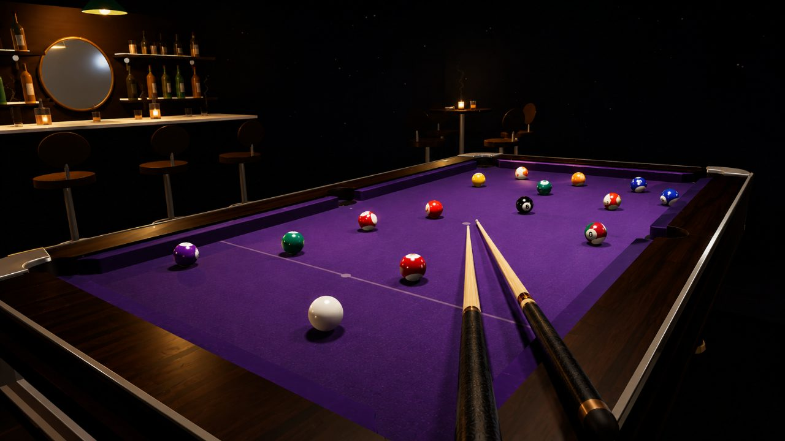
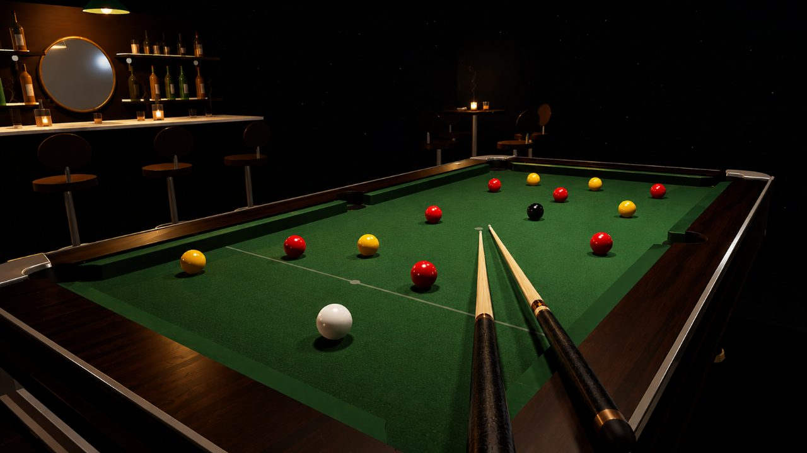
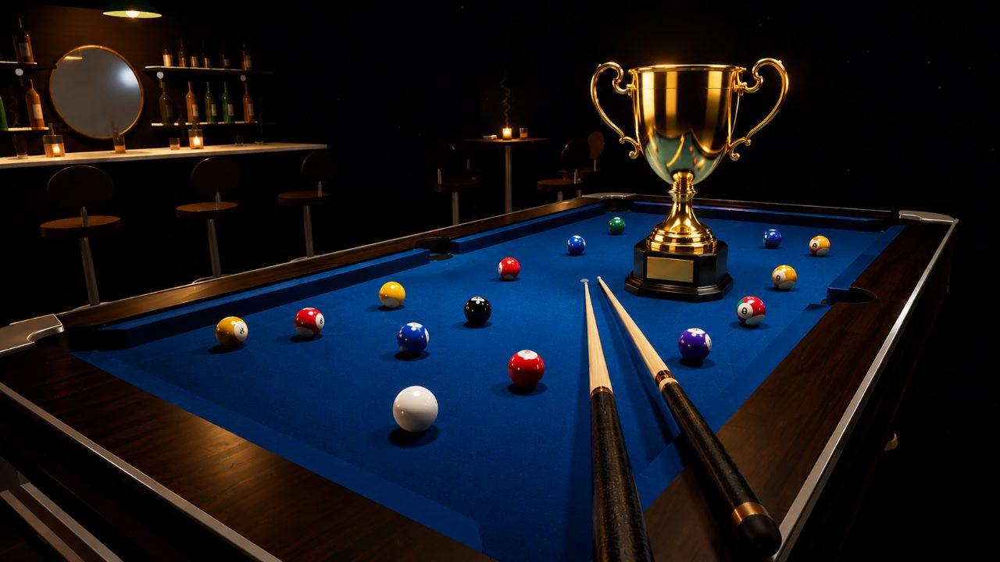

# The Gilded Rail

A 1920s private–billiards-club **3D 8-ball pool game** that runs entirely in the
browser on [Three.js](https://threejs.org/) — regulation physics, a career
ladder, unlockable tables and cues, AI opponents, local two-player and online
private rooms.

The project lives in [`the-gilded-rail/`](the-gilded-rail/).



---

## Features

**Games** — 8-Ball, English (reds vs yellows), 9-Ball, and a no-rules Practice
table. Full WPA-style rules, called pockets, ball-in-hand fouls.

**Physics** — regulation 57.15 mm / 170 g balls, slide→roll friction, cushion
compression, throw and english (side spin), jump shots, and a cue ball that can
leave the table on a bad hit.

**Modes**
- **Career** — five leagues of five opponents (25 in all), climbing from the
  Back Room to House Champion.
- **Quick Match** — vs CPU at three difficulties (Regular / Hustler / Shark), or
  local two-player on one device.
- **Online** — private rooms over a shared 6-character code, with live match
  chat. Play as a throwaway guest or a signed-in member.

**Progression** — XP and levels (cap 50, then prestige), daily and weekly
challenges, achievements, and unlockable cloth colours, cue woods and rail
finishes.

**Accounts** (optional) — email + password on [Supabase](https://supabase.com/)
Auth, with email verification, TOTP two-factor, and hCaptcha on every auth step.
A member's progress is mirrored to the cloud and **merged** across devices; guests
keep playing straight from `localStorage`.

**Presentation** — depth-of-field and bloom post-processing, glossy balls, soft
shadows, a fully modelled club room (back bar, lounge, ball-return cabinet),
recorded ball / cushion / pocket audio, and a configurable graphics-quality
setting.

|  |  |
|---|---|
|  |  |

---

## Run it locally

```bash
cd the-gilded-rail
npm install        # three + vite (dev only)
npm run dev        # http://localhost:5173 with hot reload
```

A static server is required (not `file://`) so the audio assets can be fetched
and decoded by WebAudio.

| Command | What it does |
|---|---|
| `npm run dev` | Vite dev server — serves the multi-file source as-is. |
| `npm run build` | Inlines everything (CSS, all engine files, audio as `data:` URLs) into a single portable `dist/index.html`. |
| `npm test` | Headless smoke / feature suite (137 checks) against `src/engine/`. |

---

## Deploy (Vercel)

The shippable artifact is the single-file build.

1. Import the repo in Vercel and set the project **Root Directory** to `the-gilded-rail`.
2. `vercel.json` does the rest: it runs `npm run build` and serves `dist/`, and
   ships a strict Content-Security-Policy plus HSTS / `nosniff` /
   `X-Frame-Options` / `Referrer-Policy` / `Permissions-Policy` headers.

Any static host works too — serve `dist/index.html`, or the multi-file source
behind any static server.

---

## Project layout

```
the-gilded-rail/
├── index.html          # page shell + ordered <script> tags (the load order)
├── src/
│   ├── styles/main.css
│   └── engine/          # the game, split into numbered load-order files (01…23)
├── public/assets/       # audio, glTF props, UI artwork
├── vendor/              # Three.js r128, its post-processing passes, Supabase (all vendored)
└── tools/
    ├── build-single-file.mjs   # the portable dist/ build
    └── smoke-test.cjs          # the headless feature suite
```

The engine is **plain global-scope script**, not ES modules — every file shares
one namespace and the numeric prefixes are the load order. Concatenating
`src/engine/*.js` in order reproduces the original single-file engine exactly.
A full, ready-to-run recipe for moving to ES modules lives in
[`the-gilded-rail/MIGRATION.md`](the-gilded-rail/MIGRATION.md).

---

## Controls

- **Drag / ← →** aim · **Space** hold to charge, release to strike · **E** fine-tune spin
- **G** cycle the aim guide · **Tab** walk & orbit the room · **WASD + drag** look · **scroll / pinch** zoom
- **H** hide the interface · **⛶** fullscreen · **Esc** menu
- Touch: on-screen move + look thumbsticks, drag to aim

---

## A note on the soundtrack

`03-audio.js` reads `window.__SONG` (set in `index.html`). The bundled track is a
well-known copyrighted recording — **swap it for a licensed / royalty-free /
public-domain track before publishing to real users.** All other sound (ball
impacts, cushions, ambience) is either a recorded sample or synthesized at
runtime and is fine to ship.
